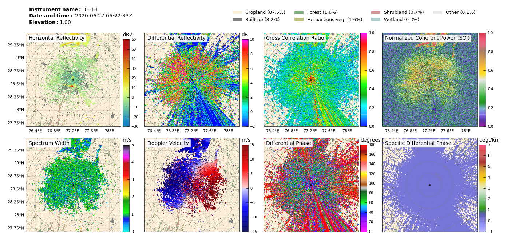

# pestdar
Scripts for making plots and geotiffs of radar data

[geotiffs/](https://github.com/sarah-barr/pestdar/tree/main/geotiffs) : scripts for gridding radar data and creating geotiffs for use in arcGIS and R

[plotting/](https://github.com/sarah-barr/pestdar/tree/main/plotting) : scripts for creating plots (incl. submitting jobs to JASMIN)

[locust_classification/](?) : scripts to impliment decision tree for classifying radar data, plotting locusts and creating locust geotiffs 
